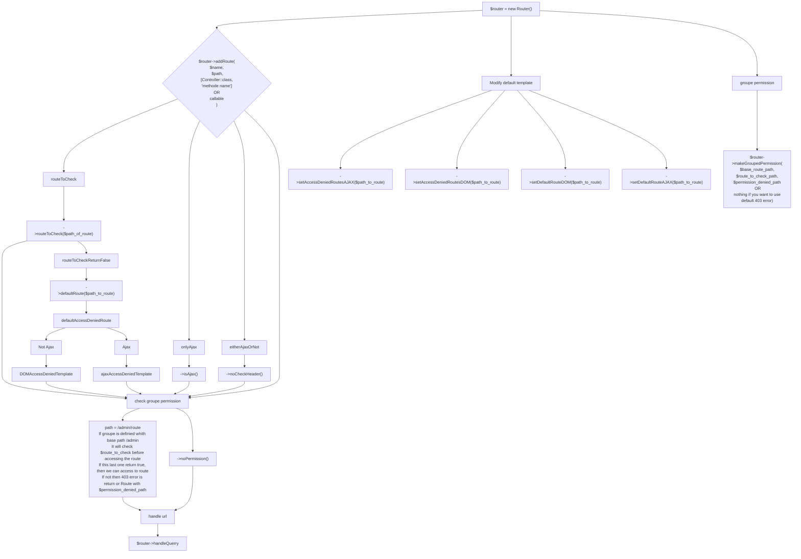

# router

$router = new Router(new Route("home", "/",[HomeController::class,"home"]),true);   

To call a methode with parameter juste surround the exact name of the variable with {}: 

$router->addRoute("articles","/article/{id}",[ArticleController::class, "showArticleById"]);   

To add a route to check (the route need to return a bool) before accesing the route: 

$router->addRoute("admin connection", "/admin/connection", [AdminController::class, "connect"]); 
$router->addRoute("admin check connection", "/admin/checklog", [AdminController::class, "checkLog"]); 
$router->addRoute("admin page", "/admin/home", [AdminController::class, "home"]) 
        ->routeToCheck("/admin/checklog") 
        ->defaultRoute("/admin/connection"); 

If the route to check return false then 403 will be return except if u use ->defaultRoute then it will call this last one

Route are not accessible from an ajax call, To reverse it and only make it accessible from ajax: 
To make this work, this.req.setRequestHeader('X-Requested-With', 'XMLHttpRequest'); 
I recommande you tu use a moderne js framework or to use my lib AjaxMaker 

$router->addRoute("ajax route", "/foo", [ApiController::class, "foo"])->isAjax(); 

To make a Route both accessible from AJAX or not:  
$router->addRoute("admin check connection", "/admin/checklog", [AdminController::class, "checkLog"])->noCheckHeader(); 
$router->addRoute("ajax route", "/foo", [ApiController::class, "foo"])->isAjax()->routeToCheck("/admin/check"); 

To set a Route to be access directly after Route call and not taking care about if routeToCheck return true: 
$router->addRoute("check formulaire post data","/admin/post/checkData", [AdminController::class, "checkPostData"])->then("/admin/post/showData");
$router->addRoute("afficher post data", "/admin/post/showData", [AdminController::class, "showData"])->routeToCheck("/admin/post/checkData");

To handle the router in the navigator:

$router->handleQuery();

To modifie access denied page :  

$router->setAccessDeniedRoutesAJAX(Route); 
$router->setAccessDeniedRoutesDOM(Route); 

To modifie route not found page : 
$router->setDefaultRouteDOM(Route); 
$router->setDefaultRouteAJAX(Route);

To make a groupe of route need to check a route 

